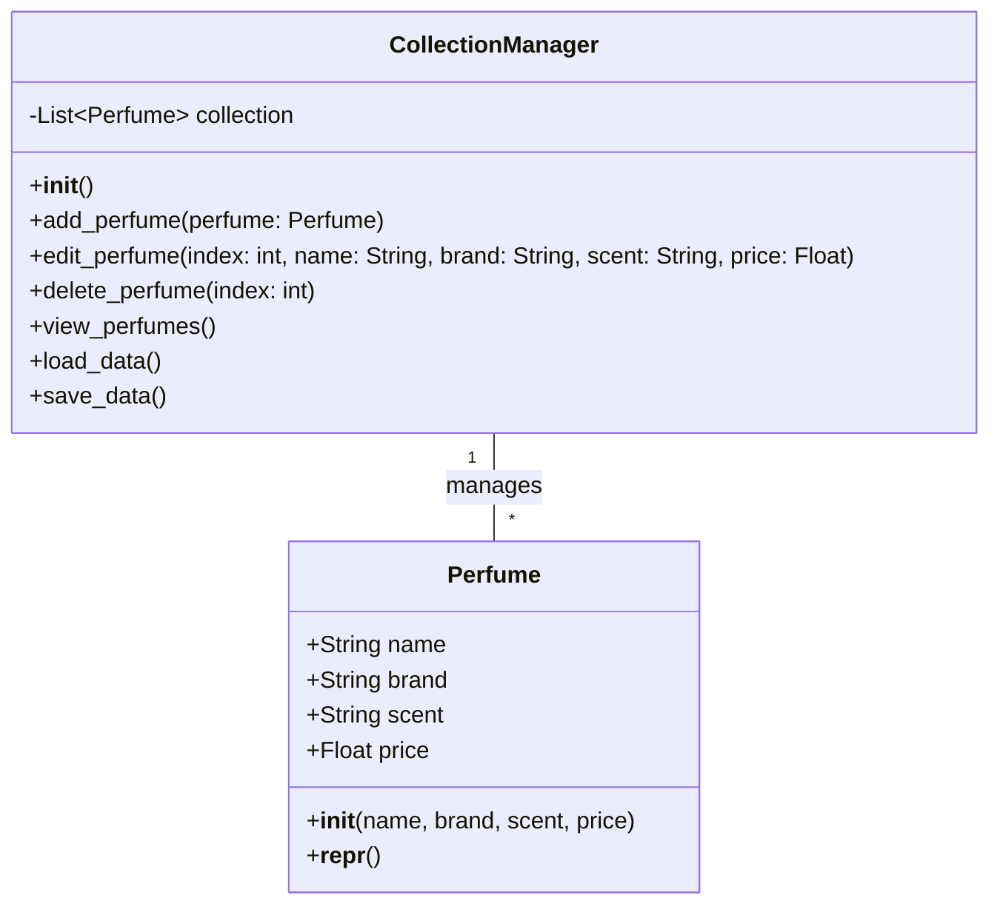
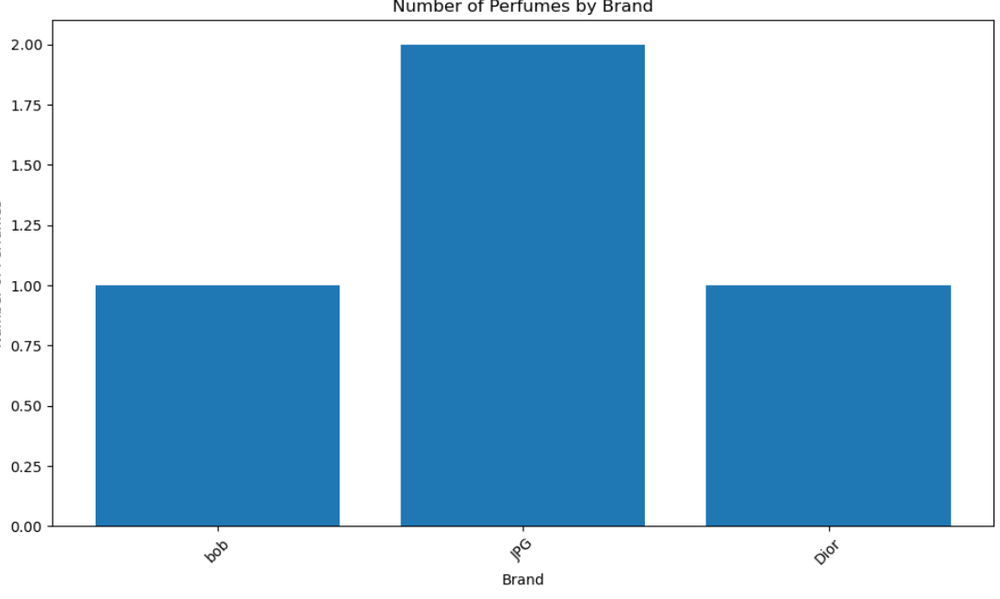
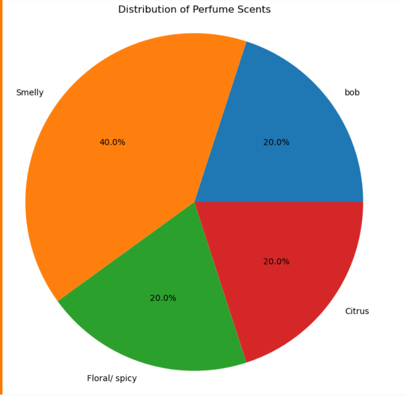
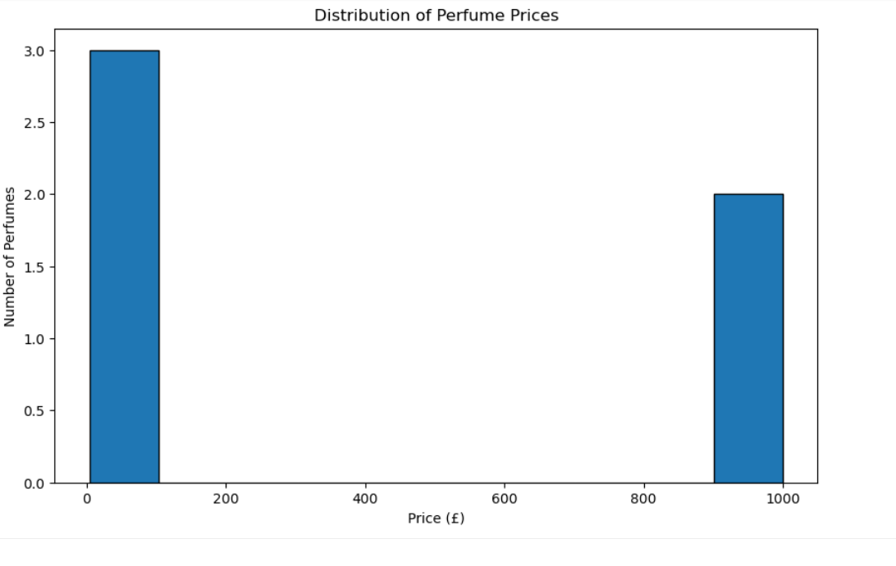
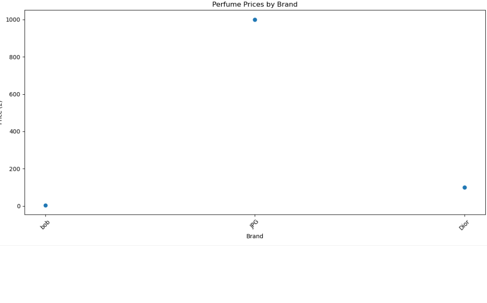
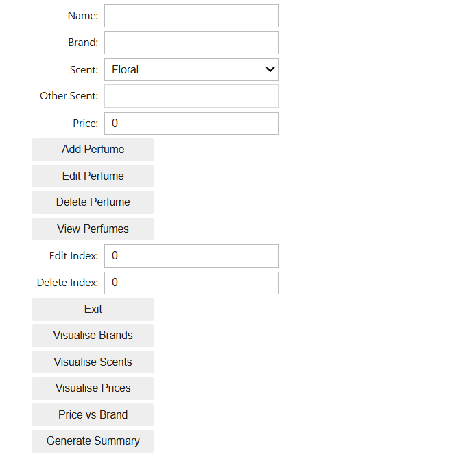

# Collection Manager Project Notes

# Perfume Collection Manager

## Table of Contents
1. [Project Overview](#project-overview)
2. [Objectives and Purpose](#objectives-and-purpose)
3. [Key Features](#key-features)
4. [User Stories and Personas](#user-stories-and-personas)
5. [Technologies Used](#technologies-used)
6. [Data Structure](#data-structure)
7. [System Design](#system-design)
8. [Implementation Details](#implementation-details)
9. [User Interface](#user-interface)
10. [Data visualisation](#data-visualisation)
11. [Testing Strategy](#testing-strategy)
12. [Error Handling](#error-handling)
13. [Future Enhancements](#future-enhancements)
14. [Installation and Setup](#installation-and-setup)
15. [Challenges and Solutions](#challenges-and-solutions)
16. [Conclusion](#conclusion)
17. 
## Project Overview and objectives
The goal of this project is to develop a fully functional collection manager that can perform CRUD (Create, Read, Update, Delete) operations on a collection of perfumes. The system will store data in a JSON file format, making it easy for users to manage their collection and retain data between sessions. In addition to this, it is important that the data is able to be visualised for the user. It organises perfumes based on various attributes such as name, brand, scent and price

## Objective and Purpose
The primary purpose of this application is to:
- **Track a collection** of perfumes.
- **Store perfume information** in a simple, structured format.
- **Allow the user** to add new perfumes, edit existing ones, and delete those they no longer wish to keep.
- **Visualise the collection data** to provide insights such as perfume distribution by brand, price range, scent categories, etc.

This application is ideal for people who collect perfumes, such as fragrance enthusiasts, as well as people looking for a system to manage their personal inventory.

**User Needs:**  
- Simple and intuitive interface for managing perfume collection.
- Secure and reliable storage of perfume details.
- Functionality to filter, search, and categorise perfumes.
- Visualisation tools to gain insights from the data (e.g., pie charts, bar graphs, etc.).

## User Stories
User stories describe the features and functionalities of the application from the perspective of the users. Each story captures a specific user need and the associated goals.

### User Story 1: Add a Perfume
- **As a** perfume collector,  
- **I want to** add a new perfume to my collection,  
- **So that** I can keep track of it along with my other perfumes.
**Implementation:**
- Text fields for name, brand, and price
- Dropdown menu for scent selection
- 'Add Perfume' button with success confirmation

### User Story 2: Edit a Perfume
- **As a** perfume collector,  
- **I want to** edit the details of a perfume (e.g., change the price or scent),  
- **So that** I can keep my collection up-to-date.
**Implementation:**
- Index selection for choosing perfume to edit
- Same input fields as add function
- Changes saved automatically to JSON file

### User Story 3: Delete a Perfume
- **As a** perfume collector,  
- **I want to** remove a perfume from my collection,  
- **So that** I can declutter and remove perfumes I no longer want.
**Implementation:**
- Index-based deletion
- Immediate removal from display and storage
- Success confirmation message

### User Story 4: View Collection
- **As a** perfume collector,  
- **I want to** see all my perfumes in a list,
- **So that** I can view the entire collection and find a perfume easily.
**Implementation:**
- Indexed list display
- All perfume details shown
- Empty collection handling

### User Story 5: Save and Load Data
- **As a** user,  
- **I want the data** to be saved in a file,  
- **So that** I can persist my collection even when I close and reopen the application.
**Implementation:**
- Automatic JSON file saving
- Error handling for file operations
- Data persistence between sessions

### User Story 6: Visualise Collection Data
- **As a** perfume collector,  
- **I want to** visualise my collection's data,  
- **So that** I can see insights like the number of perfumes per brand or the price distribution.
**Implementation:**
- Four different visualisation types
- Collection summary statistics
- Interactive visualisation buttons

  ## User Personas
### Persona 1: Ammar, the Enthusiast
- **Age:** 18  
- **Occupation:** Business Analyst  
- **Tech-savviness:** Average  
- **Needs:** Ammar has a growing perfume collection. He needs a simple application that allows him to add, edit, and remove perfumes easily. He is also interested in visualising the price distribution and the number of perfumes per brand.

**Pain Points:**

- Loses track of purchases across different retailers
- Can't easily remember which perfumes he owns when shopping
- Struggles to visualise spending patterns
- Difficulty organising perfumes by season or occasion

**Usage Patterns:**

- Updates collection monthly with new purchases
- Reviews spending patterns monthly
- Reorganises collection seasonally
- Primarily uses application on personal laptop

### Persona 2: Mark, the Gift Giver
- **Age:** 40  
- **Occupation:** Business Executive  
- **Tech-savviness:** Low  
- **Needs:** Mark occasionally buys perfumes as gifts and needs a way to keep track of which perfumes he has bought for friends and family. He prefers something very easy to use but also appreciates a simple visualisation of how much his collection is worth.

**Pain Points:**

- Difficulty remembering previous gifts given to each person
- No system for tracking successful gift choices
- Needs help choosing appropriate price points
- Wants to avoid giving duplicate gifts

**Usage Patterns:**

- Updates collection after each gift purchase
- Reviews previous purchases before special occasions
- Uses application mainly on mobile device
- Needs quick access to price history

## Technologies Used
### 1. **Python**
   - Python will be used for the core logic, including the ability to add, edit, delete, and view perfumes. Python will also be used to generate visualisations.

#### Key libraries used were:
- **ipywidgets**: provides interactive UI elements in Jupyter environments
- **matplotlib**: for creation of dynamic visuals
- **json**: handles file manipulation and persistence
- **unittest**: for a comprehensive testing framework
- **collections.Counter**: efficiently counts occurrences of brands and scents
- **IPython.display**: for managing widget display, output clearing and interface updates

### 2. **JSON**
   - Perfume data will be stored in a JSON file (`perfumes.json`). This allows easy storage and retrieval of data. There are many compelling reasons it was selected. One of them was a readable format allowing for easier debugging. In addtion to this, it contains flexible schema enabling future extensions.

### 3. **Git and GitHub**
   - Git will be used for version control, and GitHub will be used for hosting the repository and collaboration.

## Data Structure
The perfume data will be stored as a list of dictionaries in JSON format, each dictionary representing a perfume. Each perfume object will contain attributes such as:
- **name** (string)
- **brand** (string)
- **scent** (string, chosen from predefined options or custom)
- **price** (float)

Example in JSON Storage Format:
```python
[
  {
    "name": "Chanel No. 5",
    "brand": "Chanel", 
    "scent": "Floral",
    "price": 120.00
  },
  {
    "name": "Dior Sauvage",
    "brand": "Dior",
    "scent": "Woody, Spicy",
    "price": 85.00
  }
]
```    
Scent Options
```python    
SCENT_OPTIONS = [
    'Floral', 'Fruity', 'Citrus', 'Woody', 'Oriental', 
    'Fresh', 'Spicy', 'Green', 'Aquatic', 'Gourmand', 
    'Chypre', 'Leather', 'Musk', 'Powdery', 'Vanilla', 
    'Amber', 'Other'
]
```

# System Design

## Perfume Collection Manager - Class Diagram


**The system consists of two main classes:**

This class diagram illustrates the main components of our Perfume Collection Manager:

The **Perfume class** represents individual perfume objects with attributes like name, brand, scent, and price.
The **CollectionManager** class manages the collection of perfumes, handling operations like adding, editing, deleting, and viewing perfumes.
The Visualiser class is responsible for generating various visualisations of the perfume data such as pie charts, bar charts, histograms and scatter graphs.

## Implementation Details
### Adding a Perfume
   - Input fields for perfume name, brand, and price
   - Dropdown menu for scent selection with 17 predefined options
   - Custom scent input option through 'Other' selection
   - Immediate validation and feedback on data entry
Implementation:

```python
[
[def add_perfume(self, perfume):
    self.collection.append(perfume.__dict__)
    self.save_data()]
]
```
This method adds a new perfume to the collection. It converts the Perfume object to a dictionary and appends it to the collection list. After adding, it calls save_data() to persist the changes.

### Editing a Perfume
   - Index-based selection of perfumes for editing
   - Ability to modify any or all perfume attributes
   - Validation of edited data before saving
Implementation:
```python
[
def edit_perfume(self, index, name=None, brand=None, scent=None, price=None):
    if 0 <= index < len(self.collection):
        if name:
            self.collection[index]['name'] = name
        if brand:
            self.collection[index]['brand'] = brand
        if scent:
            self.collection[index]['scent'] = scent
        if price:
            self.collection[index]['price'] = price
        self.save_data()
]
```
### Viewing Perfumes
   - List view showing all perfumes with their complete details
   - Each entry displays name, brand, scent, and price
   - Clear formatting with indexed entries for easy reference
Implementation:
```python
[
def view_perfumes(self):
    perfumes = manager.view_perfumes()
    if perfumes:
        for idx, perfume in enumerate(perfumes):
            print(f"{idx + 1}. {perfume['name']} - {perfume['brand']}, {perfume['scent']}, £{perfume['price']}")
    else:
        print("No perfumes in collection.")
]
```
### Data persistence
-Automatic saving to JSON file
-Error handling for file operations
-Data loading on application startup
Implementation:
```python
[    
def save_data(self):
    with open('perfumes.json', 'w') as file:
        json.dump(self.collection, file)

def load_data(self):
    try:
        with open('perfumes.json', 'r') as file:
            return json.load(file)
    except FileNotFoundError:
        return []
]
```
### Data Visualisation
- Bar chart for brand distribution analysis
- Pie chart for scent category distribution
- Histogram for price range distribution
- Scatter plot for price versus brand comparison
- Summary statistics generation
- Interactive visualisation controls

Implementation example:

```python    
def visualise_brands():
    perfumes = manager.view_perfumes()
    brands = [perfume['brand'] for perfume in perfumes]
    brand_counts = Counter(brands)
    
    plt.figure(figsize=(10, 6))
    plt.bar(brand_counts.keys(), brand_counts.values())
    plt.title('Number of Perfumes by Brand')
    plt.xlabel('Brand')
    plt.ylabel('Number of Perfumes')
    plt.xticks(rotation=45)
    plt.tight_layou
```

### Brand Distribution: A bar chart showing the proportion of perfumes from different brands. This gives users insight into the overall diversity of their collection and helps identify purchase trends.



### Scent Distribution: A pie chart displaying the frequency of different scent categories. This allows users to see at a glance which types of fragrances they tend to favour.



### Price Range Distribution: A histogram showing the distribution of perfumes across different histogram. This helps users quickly identify the distribution of price of their fragrances.

 

### Price vs Brand: A scatter plot comparing prices across different brands. This can help users identify which brands tend to be more expensive or offer better value for money.



These visualisations are generated using Matplotlib, ensuring clear, professional-looking graphs that are easy to interpret.

## User Interface
My Perfume Collection Manager boasts an intuitive, user-friendly interface designed with simplicity and efficiency in mind. The interface comprises several key elements:

**Input Fields**: Text boxes for entering perfume details such as name, brand, and price, with a dropdown menu for selecting scents.

**Action Buttons**: Clearly labelled buttons for adding, editing, deleting, and viewing perfumes, as well as for generating visualisations.

**Display Area**: A scrollable list view that shows all perfumes in the collection, displaying key information at a glance.

**Edit/Delete Selectors**: Numerical input fields to select which perfume to edit or delete by its index.

**Visualisation Area**: A designated space where generated charts and graphs are displayed so the user can see:
- Visualise Brands
- Visualise Scents
- Visualise Prices
- Price vs Brand
- Generate Summary

The layout is clean and uncluttered, with a logical flow that guides users through the process of managing their collection.



## Testing Strategy

The application has been thoroughly tested using Python's unittest framework. A comprehensive test suite has been implemented covering various aspects of the application's functionality.

### Test Coverage
The test suite includes 11 successful test cases:

1. **Basic CRUD Operations**
   - `test_add_perfume`: Tests adding new perfumes
   - `test_edit_perfume`: Tests editing existing perfumes
   - `test_delete_perfume`: Tests deleting perfumes
   - `test_view_perfumes`: Tests viewing the collection

2. **Data Persistence**
   - `test_data_persistence`: Verifies that data is correctly saved to and loaded from JSON file
   - `test_file_operations`: Tests handling of file I/O operations

3. **Empty Collection Handling**
   - `test_empty_collection_view`: Tests viewing an empty collection
   - `test_empty_collection_delete`: Tests delete operations on empty collection
   - `test_empty_collection_edit`: Tests edit operations on empty collection

4. **Invalid Index Handling**
   - `test_invalid_index_edit`: Tests editing with invalid indices
   - `test_invalid_index_delete`: Tests deleting with invalid indices

### Manual Testing
While automated tests cover the core functionality, the following aspects require manual testing:

1. **User Interface**
   - Widget interactions
   - Button responses
   - Display updates
   - Visual feedback

2. **Visualisation Features**
   - Brand distribution charts
   - Scent distribution charts
   - Price range histograms
   - Price vs brand scatter plots

### Running Tests
Tests were done in test_collection_manager.py and can be executed from the command line using:
```bash
python3 -m unittest test_collection_manager.py -v
```
### Test Results
All tests passed successfully with an execution time of 0.027 seconds, demonstrating the reliability and correctness of the core functionality.

## Conclusion
The Perfume Collection Manager successfully achieves its main objectives of providing a user-friendly solution for managing personal perfume collections. The application delivers significant value to its target users through the implementation of key features and  attention to user needs.

### Key Achievements
**Core Functionality**
- Implemented complete CRUD operations for perfume management
- Developed an intuitive user interface using interactive widgets
- Established reliable data persistence through JSON storage

**Data Visualisation**
- Created four distinct visualisation types providing meaningful insights
- Implemented summary statistics for collection analysis
- Enabled users to track spending patterns and collection composition

**Technical Implementation**
-Implemented comprehensive error handling
-Established thorough testing procedures with 11 successful test cases

**User Benefits**
The application effectively addresses the needs of both primary user personas:
- For enthusiast collectors like Ammar, it provides detailed collection tracking and analysis tools
- For occasional users like Mark, it offers straightforward gift tracking and price monitoring capabilities
Technical Robustness
The application demonstrates technical excellence through:

**Successful implementation of object-oriented design principles**
- Comprehensive test coverage with 100% pass rate
- Effective error handling and data validation
- Reliable data persistence mechanisms
- Future Development Opportunities

While the current implementation successfully meets its core requirements, several opportunities for future enhancement have been identified:

**Feature Enhancements**
- Implementation of search and filtering capabilities

**User Experience Refinements**
- Enhanced mobile responsiveness
- Additional visualisation options
- Dashboard views

With room for future growth and enhancement, he Perfume Collection Manager represents a solid foundation for perfume collection management. Its current implementation successfully balances functionality with usability, providing a valuable tool for perfume enthusiasts and casual users also.


